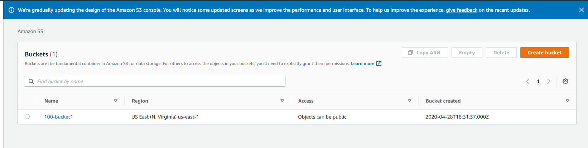
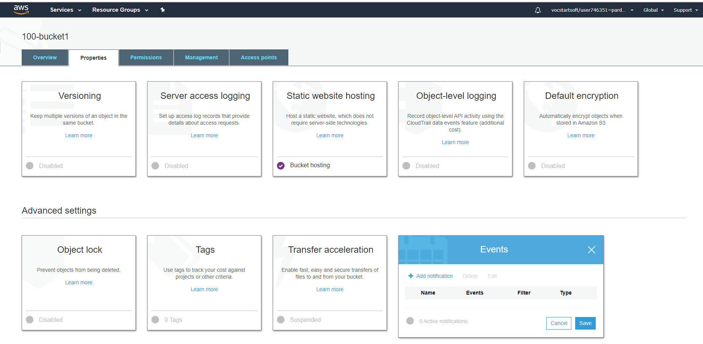
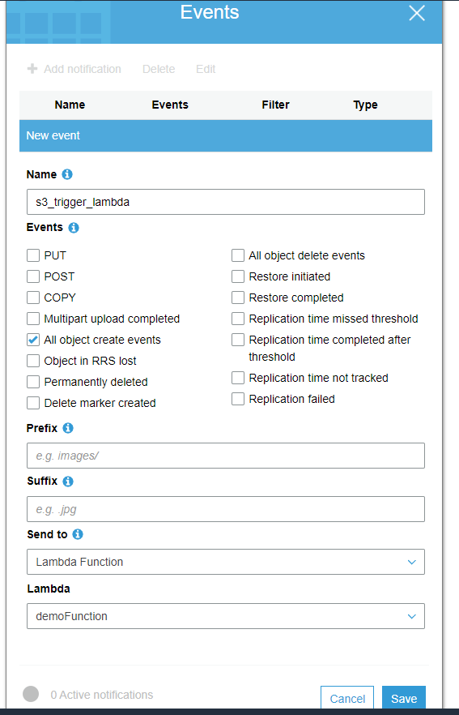
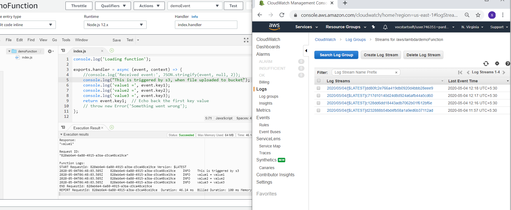
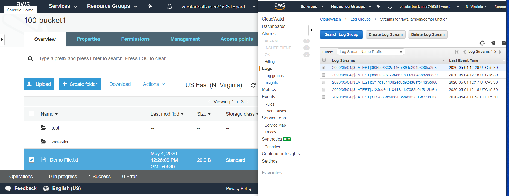

# How to trigger lambda function on uploading a file in s3.

      Follow these steps after creating a function:

**Step 1. Go to services, click on s3 and it will show buckets created as below.**
      - Here bucket name is : 100-bucket1
      

---

**Step 2. After clicking on bucket name, got to properties tab.**
      - There you can see *Events* tab as shown below.

---

**Step 3. Configure the event as shown below.**

---

**Step 4. Now, for testing make some changes in function and just save it and do not run the code. Below image shows function and old logs in CLoudwatch.**
      

---

**Step 5. Click on services, search for lambda.**

- Here a file named Demo File.txt is uploaded.
- Amd log, shows lambda function is triggered and log in cloudwatch.

