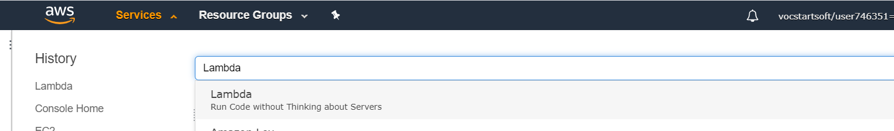
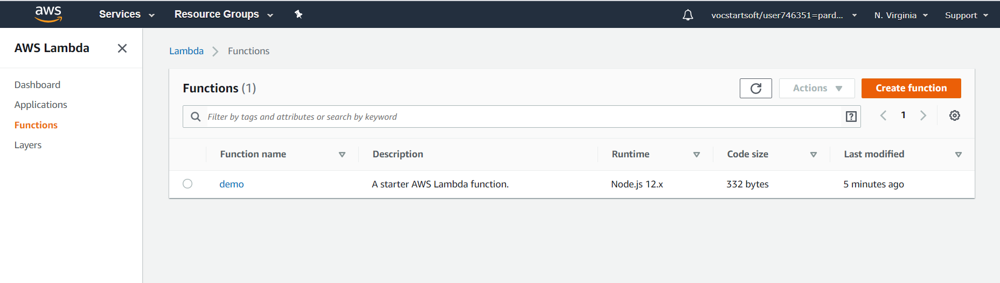
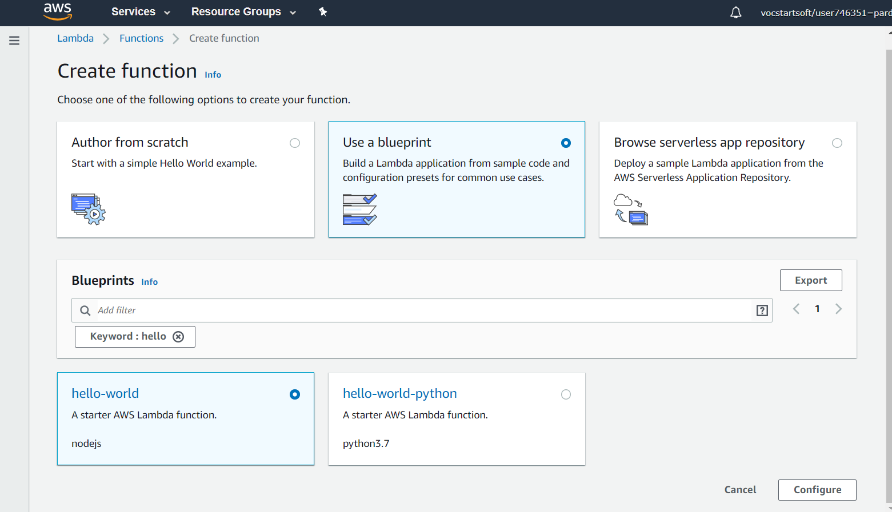
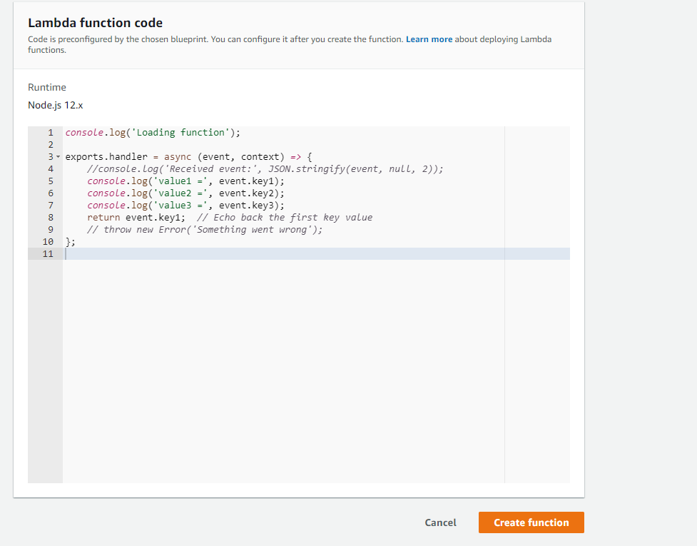
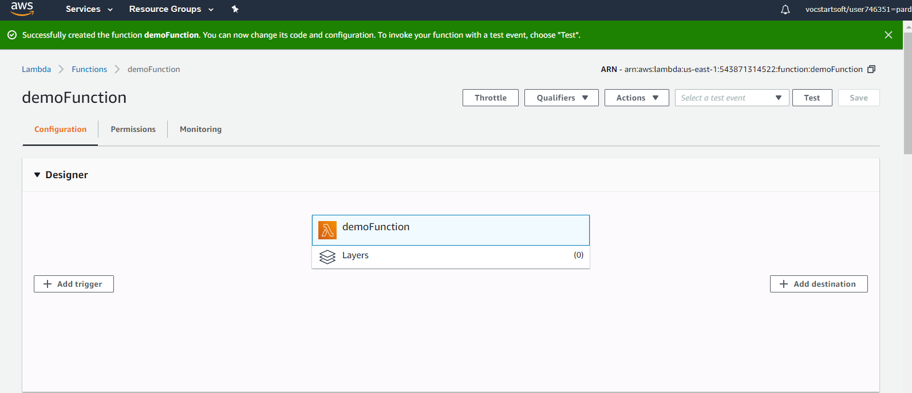
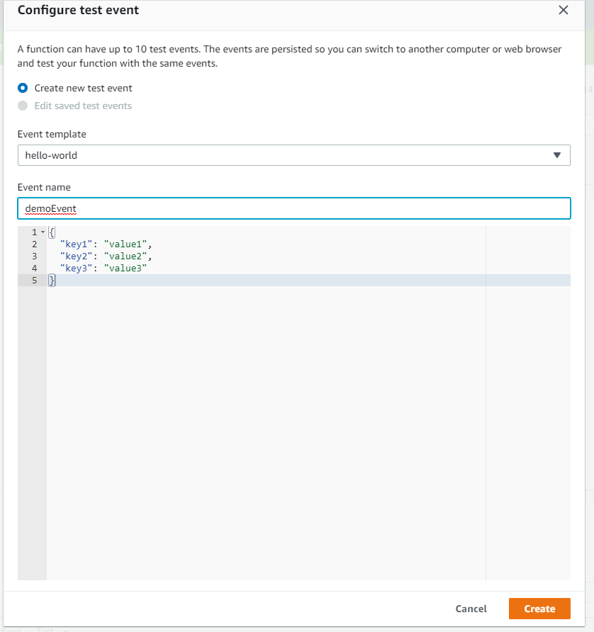
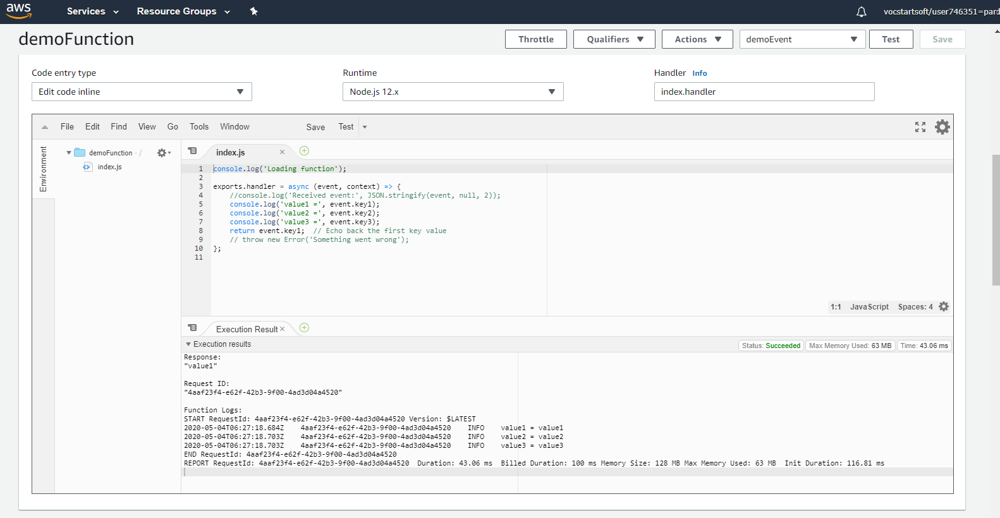

# How to create lambda function

      Follow these steps for creating a function:

**Step 1. Click on services, search for lambda.**

---

**Step 2. Click on services, search for lambda.**

---

**Step 3. Use a predefined blueprint.**

---

**Step 4. Write your function as shown below and click on create function.**

---

**Step 6. This window will appear,select configure event from select event dropdown.**

---

**Step 7. Given event name, edit event and click on create.**

---

**Step 8. You can test/run your code here, right below editor, a console ios provided.**

---

