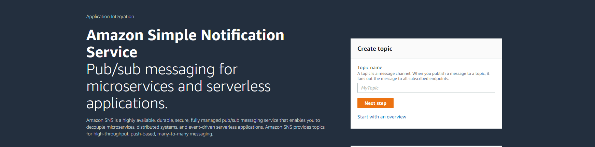

# What is topic and how to create topic

- In SNS, We create channel known as topic.
- When you publish a message to a topic, it send the message to all subscribers.

---

Step 1: Search for SNS service,and select simple notofication service(sns).

---

Step 2: Give topic name and click on next step.
---

---

Step 3: Configuration settings for topic and create topic.
		-  	Access policy >> 
				1. Who can subscribe to this topic >>
					**Everyone**
				2. Who can publish this 
					**Everyone**
			(According to requirement).		
		- 	Delivery status logging -optional.
		- 	Here, you can add encryption for sensitive messages.
		- 	Can log the message to delivery status to cloudwatch.
		- 	Can add tags.
		These all are optional things.

---

## Creating subscription

Step 4: After creating topic, following window will appear, showing topic details.
		Now we want to create subscription, so click on create subscription.

---

Step 5: Provide protocol (here using email),endpoint email id and click on create subscription, 		you will receive mail for confirmation. 
		- **Subscription status** will be pending till you confirm the subscription from email, once done it will change to "Confirmed".

---

### Subscriber (receiver) and topic (channel) is ready. Now, will create publisher (In this case 		it is s3).

Step 6: Go to the properties of bucket in s3 and create event like shown below.
	

-- You will receive email whenever you upload file in bucket.

