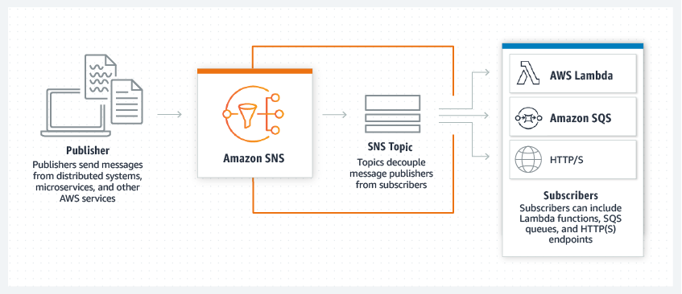
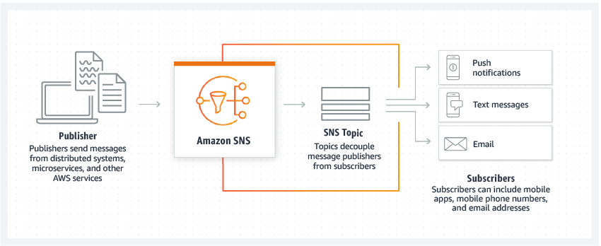

# Overview of SNS - Simple Notification Service

- SNS works in **pub/sub model** that is *publisher-subscriber or producers-consumers*.
- In SNS, we create a channel, known as topic.
- Usage exmaples: We can send email on creation of ec2, send mail when server is down, notifying 		cpu utilizatoin, etc.

**1. System to system messaging**

		Amazon SNS is a managed messaging service that lets you to decouple publishers from subscribers. This is useful for system-to-system messaging for microservices, distributed architectures, and serverless applications.

---

**2. User notifications**

		Amazon SNS lets you send push notifications to mobile apps, text messages to mobile phone numbers, and plain-text emails to email addresses. You can fan out messages with a topic, or publish to mobile endpoints directly.

