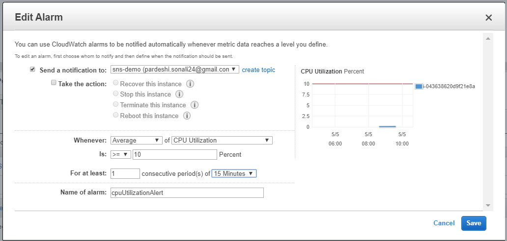

## Create alarm for cpu utilization

- Select instance, click on monitoring.
- Expand cloudwatch alarms.
- Create alarm and parameters as per requirement.

	

- You will receive email when cpu utilization meets the criteria specified in alarm.
