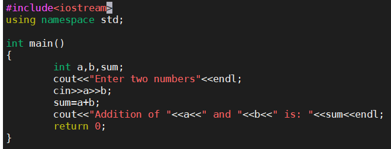
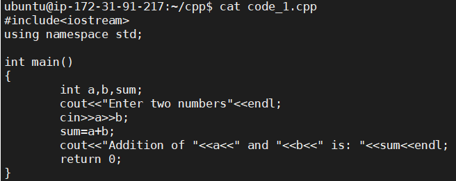
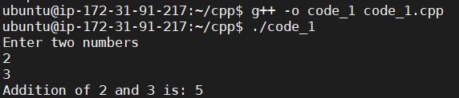

# How To Execute c++ program on linux

*Note : My directory is cpp and file name is code_1.cpp. Commands are written according to this.*

**Step 1: Create a directory**
	
		mkdir cpp

**Step 2: Create a file using vi**
	
		vi code_1.cpp

**Step 3: Exit from insert mode using esc**

**Step 4: Type :w for writing to file and write your code there.**

**Step 5: To come out of write mode, press esc and write :q to quit, you will be out of edit mode.**

**Step 6: You can also check your file content using following command**
	
		cat code_1.cpp

**Step 7: Compile and create executable file**
	
		g++ -o code_1 code_1.cpp

**Step 8: Run the code**

		g++ ./code_1.cpp

- You will get output like this - 

## Output:
	
